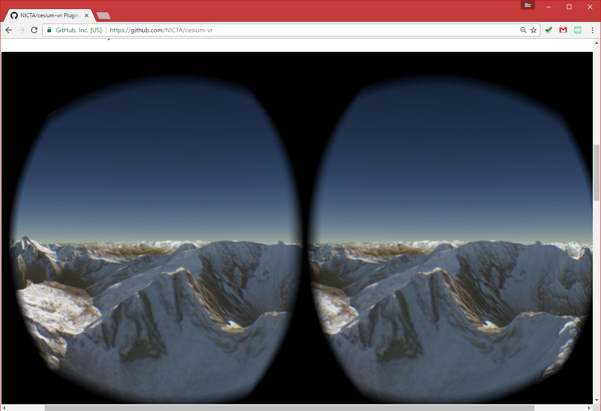
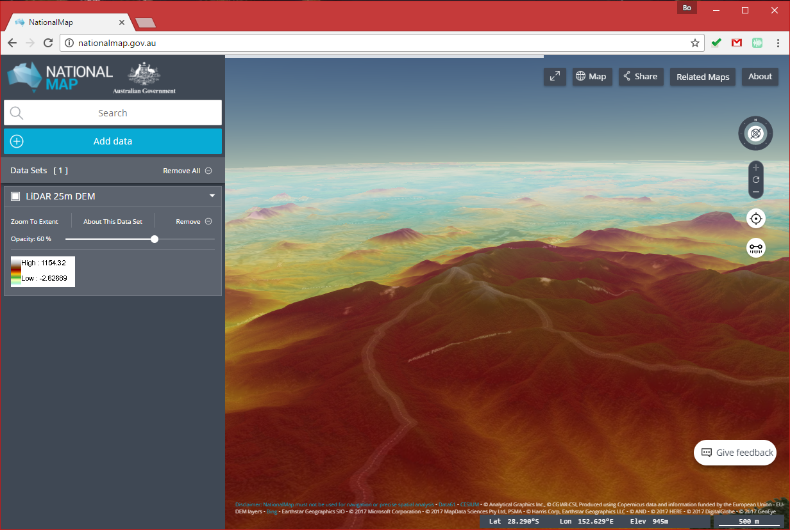
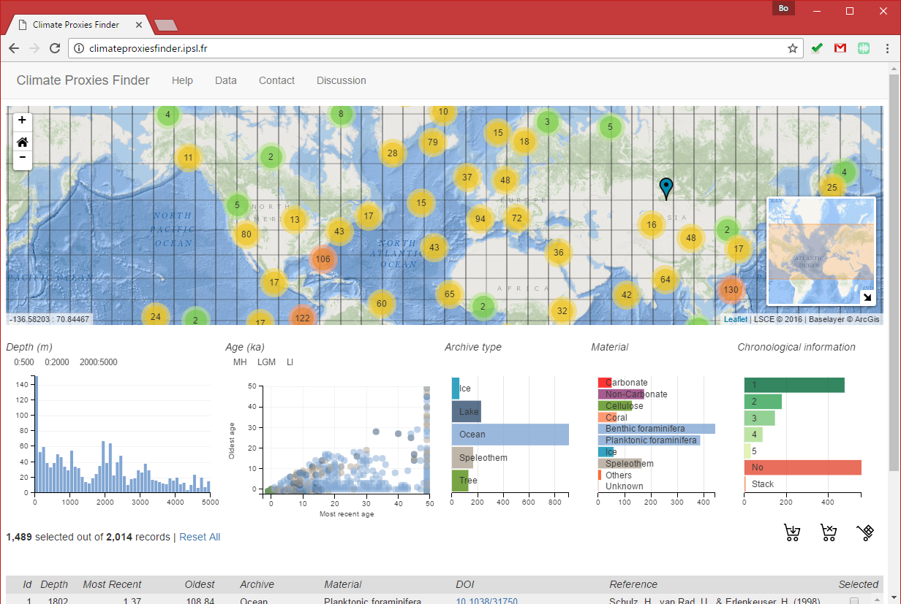

# Course Project: Brainstorm

> Spring 2018 | Geography 4/572 | Geovisualization: Geovisual Analytics
>
> **Instructor:** Bo Zhao  **Location:** WITH 210 | **Time:** TR 1100 - 1150

To find the geovisualization of your interests and the topic for the course project, this lecture will introduce some typical geovisualizations and some potential topics. Students are expected to submit the homework by 11:59pm of April 12th.

- Get to know the Digital Earth Lab @ OSU.
- Get familiar with the major types of geovisualization via trendy examples.
- Reflect on which specific geovisual analytical method(s) are of your interests.

## 1. Introduction

This course relies on a series of professional software and web applications to make, debug, and browse web maps, including:

- **Webstorm:** A web mapping programming development environment;
- **MapBox:** An integrated platform for web mapping services;
- **QGIS:** An open source GIS desktop;
- **Chrome:** A Web browser;
- **Google Earth Pro:** A three-dimensional virtual globe with various geospatial data.

## 2\. Geovisualization Examples

This section introduces some major types of interactive geovisual applications. Regarding the course project, you are expected to work as a team to make a similar geovisual application. By viewing the following geovisual applications, you would get sense how geovisual skills can be applied for illustrating real-world problems.

### 2.1 Storymap

Esri Story Maps let you combine authoritative maps with narrative text, images, and multimedia content. They make it easy to harness the power of maps and geography to tell your story.

**[A River Reborn](http://storymaps.esri.com/stories/2015/river-reborn/)**

Please pay attention to how the author uses the 2D map, 3D virtual environment and multi-media (e.g., video, images, etc.).

**[California's Getting Fracked](http://www.facesoffracking.org/data-visualization/)**

Please pay attention to the use of map elements, and how the window scrolling behavior triggers the map events.

### 2.2 Virtual Globe

**[World Population](https://globe.chromeexperiments.com/)**

**[Noise Complaints in New York City](http://rawgit.com/jakobzhao/noise_complaints/master/index.html)**

Please pay attention to how virtual globe is used to demonstrate thematic features.

**[Cesium-VR](https://github.com/NICTA/cesium-vr)**

Enable the geovisualization with the capability of virtual reality. Also, please reflect on how to overlay map and 3d model collected by UAV on to a geovisual application.

### 2.3 Spatial Data Platform

**[National Map of Australia](http://nationalmap.gov.au/)**

please pay attention to the use of virtual globe, and how different types of geospatial data (especially **maps made by UAV**) are overlain in the same visualization environment.

### 2.4 Data-driven Geovisualization

**[Stweet](http://www.we-love-the.net/Stweet/index.php?location=Portland,US)**

Please pay attention to how heterogeneous types of data are mashed up.

**[Trendsmap](img/trendsmap.png)**

Geo-tagged tweets are real-timely collected and stored in a remote database, a **word cloud** of geo-tagged hashtags are visualized. Please reflect on the multiple dimensions of a real-world issue. Can we clearly describe a phenomena merely based on one type of geovisual analytical method?

**[Climate Proxies Finder](http://climateproxiesfinder.ipsl.fr/)**

> This application allows you to select different paleo-oceanographic proxies collected at LSCE according to various dimensions (spatial position, depth, age, archive, material type and chronological information).

One data source, and multiple visual analytical ways.

**[Global temporal change](http://blogs.reading.ac.uk/climate-lab-book/files/2016/05/spiral_optimized.gif)**

**[Electric Generation in Spain](http://energia.ningunaparte.net/en/)**

Connect the idea of infographics with the data-driven visualization.

### 2.5 Advanced Geovisual Analytics

**[Economic Output of Asian Countries - New York Times](http://www.nytimes.com/interactive/2013/04/08/business/global/asia-map.html)**

> In this map, geography is distorted so that each country is **sized according to its economic output** in 2012. The countries are colored by their rate of growth; more established economies tend to grow more slowly.

The use of cartogram.

**[TrumpLand vs. Clinton Archipelago](http://www.vividmaps.com/2016/12/trumpland-and-clinton-archipelago.html)**

The use of isoline maps.

**[Migrations Map](http://migrationsmap.net/#/COD/arrivals)**

**[Small Arms and Ammunition - Import & exports](https://armsglobe.chromeexperiments.com/)**

**[A Graph of the History of Philosophy](http://www.designandanalytics.com/philosophers-gephi/)**

Please pay attention to how (social) network is implemented to visualize connectivity.

## 3\. Project Topics (TBA...)

This section lists some potential topics for the course projects.

## 4\. Homework

The purpose of this handout is to help you brainstorm and identify the geovisualization you would like to work on. Regarding the homework, please submit a word or pdf document to canvas, it should contain

(1) **a url link of the geovisualization**;

(2) a short description of the specific geovisual analytical skills you are interested; and

(3) you can also list the potential topics you would like to work on. **Think bold!** In the meantime, please keep in mind that this course is more about honing the geovisual analytical skills other than concentrating on a specific topic.

**In the lecture this Thursday (4/6)**, you are required to present one geovisualization of your interest to the class.  You should submit the homework **by noon April 5th**.

Once you finish this homework, you need to submit it to **Canvas Dropbox**. On the assignment tab,  check the item of this homework, press the `Submit Assignment` button to submit. Please contact the instructor or TA if you have any difficulty. Note: only submit your homework in Word or PDF format.