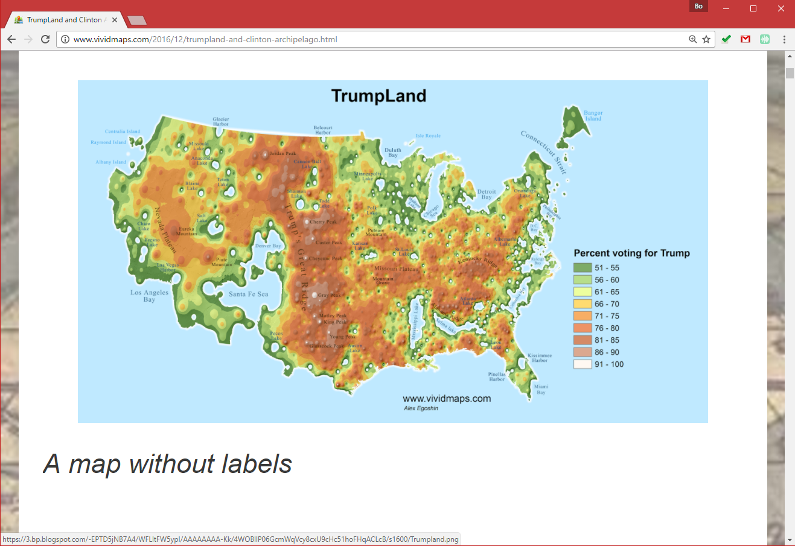
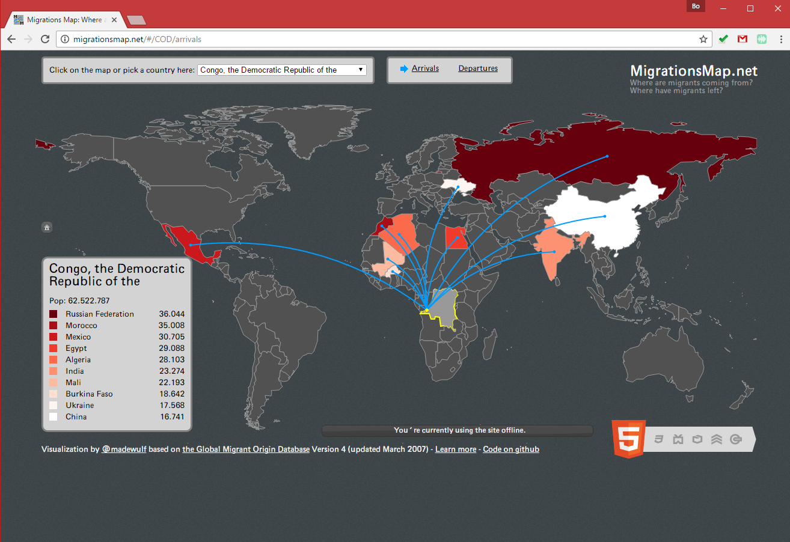
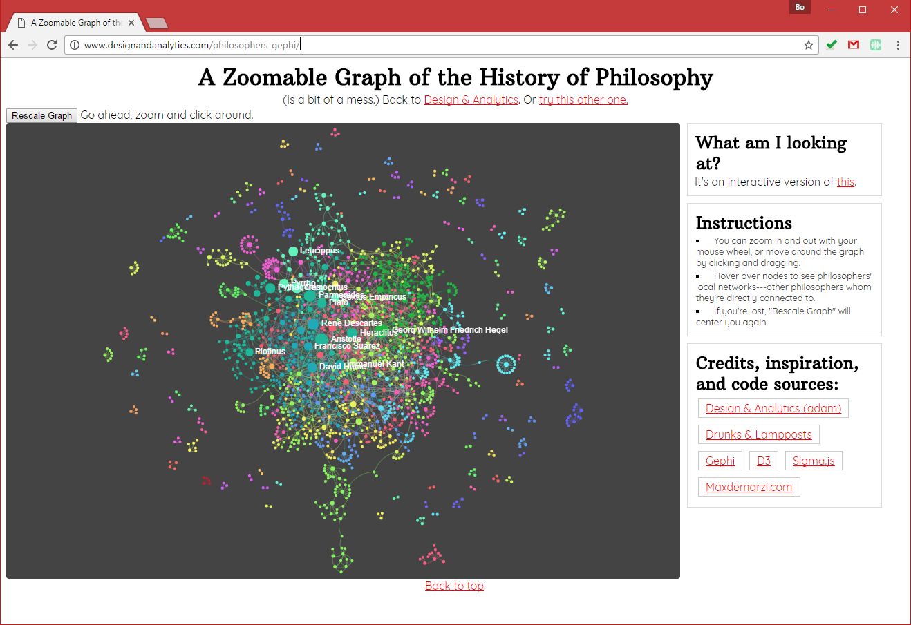
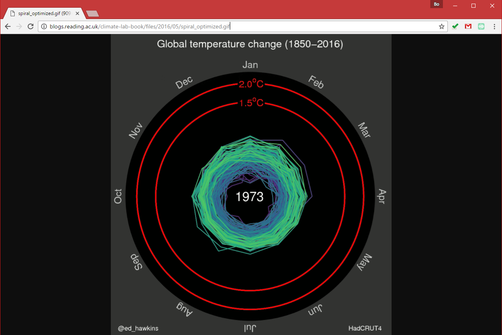
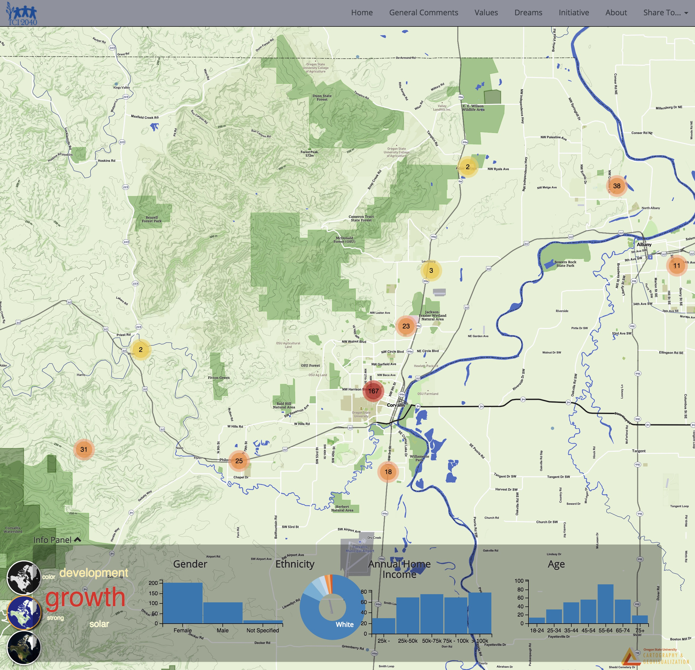
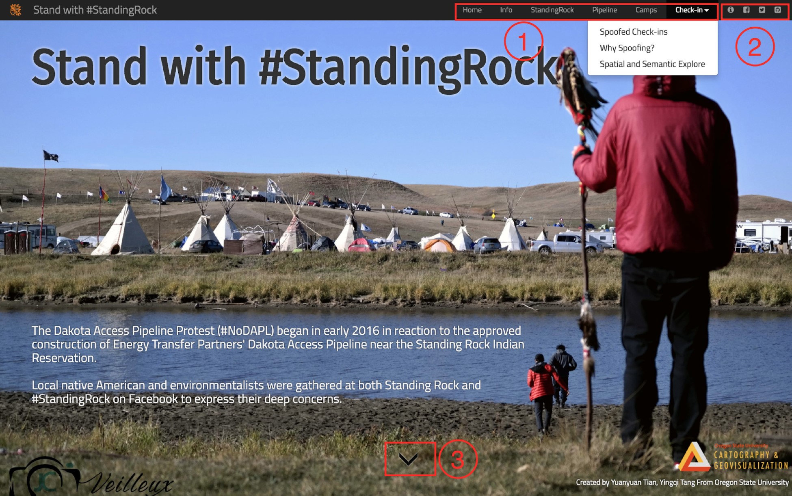
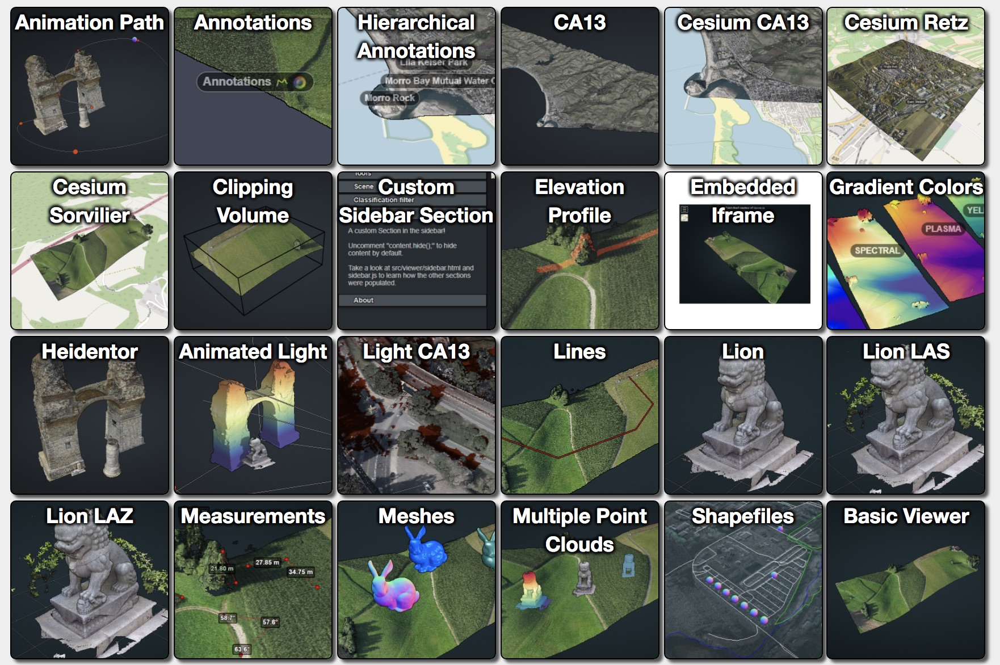
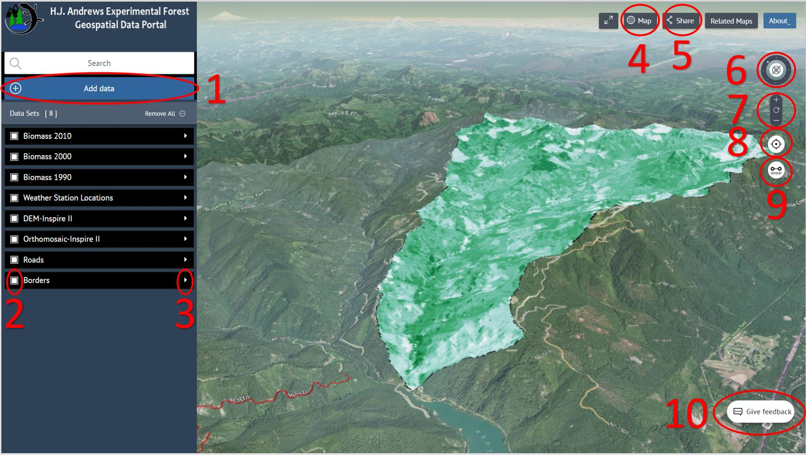

# Brainstorm

> Spring 2018 | Geography 4/572 | Geovisualization: Geovisual Analytics
>
> **Instructor:** Bo Zhao  **Location:** WITH 205 | **Time:** TR 1100 - 1150

## 1\. Major types of Geovisual Analytical applications

This section introduces some major types of interactive geovisual applications. Regarding the course project, you are expected to work as a team to make a similar geovisual application. By viewing the following geovisual applications, you would get sense how geovisual skills can be applied for illustrating real-world problems.

### 2.1 Single-view Geoviz

**[Economic Output of Asian Countries - New York Times](http://www.nytimes.com/interactive/2013/04/08/business/global/asia-map.html)**

> In this map, geography is distorted so that each country is **sized according to its economic output** in 2012. The countries are colored by their rate of growth; more established economies tend to grow more slowly.

The use of cartogram.

**[TrumpLand vs. Clinton Archipelago](http://www.vividmaps.com/2016/12/trumpland-and-clinton-archipelago.html)**

The use of isoline maps.

**[Migrations Map](http://migrationsmap.net/#/COD/arrivals)**

**[A Graph of the History of Philosophy](http://www.designandanalytics.com/philosophers-gephi/)**

Please pay attention to how (social) network is implemented to visualize connectivity.

**[Global temporal change](http://blogs.reading.ac.uk/climate-lab-book/files/2016/05/spiral_optimized.gif)**

**[Electric Generation in Spain](http://energia.ningunaparte.net/en/)**

Connect the idea of infographics with the data-driven visualization.

### 2.2 Coordinated (Multiple) View Geoviz

**[Benton County 2040](https://scottwhitson.github.io/benton/dreams.html)**

he Benton County 2040 Thriving Community Initiative (TCI) is a project in which the goal is to identify the core values and vision of the Benton County community. In order to identify community thoughts, the Thriving Communities Council conducted several surveys by hosting public events throughout the County. At these events, community members were asked to to share comments on what they like about where they lived and what they hoped to see in the future.

This project, conducted by students and faculty at Oregon State University, was done to present the results of this survey. The presentation of the results was done in a geo-visual manner which displays demographic results by city or town. The map also contains a word cloud which shows key words which identifies what the community values.

**[Climate Proxies Finder](http://climateproxiesfinder.ipsl.fr/)**

> This application allows you to select different paleo-oceanographic proxies collected at LSCE according to various dimensions (spatial position, depth, age, archive, material type and chronological information).

One data source, and multiple visual analytical ways.

### 2.3 Storymap (a.k.a geo-narrative, online map based storytelling, etc.)

**[Stand with #Standingrock](https://winkyt.github.io/standwithstandingrock/)**

Following months of conflict, triggered by a proposed pipeline, in January 2017, environmental protestors were forced to leave their camping area at Standing Rock. Today, it has become nearly impossible for people to access the former camping area. Even though protestors no longer stay there, a growing number of social media users still stand with #StandingRock by spoofing their check-ins on Facebook. With storymap techniques, this dynamic map geo-narrates the whole story of the environmental protest at Standing Rock and #standing rock.

Esri Story Maps let you combine authoritative maps with narrative text, images, and multimedia content. They make it easy to harness the power of maps and geography to tell your story.

**[A River Reborn](http://storymaps.esri.com/stories/2015/river-reborn/)**

Please pay attention to how the author uses the 2D map, 3D virtual environment and multi-media (e.g., video, images, etc.).

**[California's Getting Fracked](http://www.facesoffracking.org/data-visualization/)**

Please pay attention to the use of map elements, and how the window scrolling behavior triggers the map events.

### 2.4 Point Cloud Geoviz

[Potree](http://potree.org/index.html) is a free open-source WebGL based point cloud renderer for large point clouds, developed at the Institute of Computer Graphics and Algorithms, TU Wien.

### 2.5 Spatial Data Platform

**[HJA Geospatial data Platform]**

[http://mapious.ceoas.oregonstate.edu:3001/](http://mapious.ceoas.oregonstate.edu:3001/)

This project seeks to develop a web map-based data catalog for the H.J. Andrews Experimental Forest. The initial goal is to provide a central platform for researchers and the broader public to visualize geospatial data within a 3D digital landscape. The portal was developed using Cesium, an open-source JavaScript library for 3D maps, in conjunction with TerriaJS, a library for building geospatial data catalogs, and GeoServer, a Java-based software server that allows users to view and edit geospatial data. The datasets currently available are for demonstration purposes; this is a pilot project to be built upon in the future.

## 4\. Homework

The purpose of this handout is to help you brainstorm and identify the geovisualization you would like to work on. Regarding the homework, please submit a word or pdf document to canvas, it should contain

(1) **a url link of the geovisualization**;

(2) a short description of the specific geovisual analytical skills you are interested; and

(3) you can also list the potential topics you would like to work on. **Think bold!** In the meantime, please keep in mind that this course is more about honing the geovisual analytical skills other than concentrating on a specific topic.

**In the lecture this Thursday (4/6)**, you are required to present one geovisualization of your interest to the class.  You should submit the homework **by noon April 5th**.

Once you finish this homework, you need to submit it to **Canvas Dropbox**. On the assignment tab,  check the item of this homework, press the `Submit Assignment` button to submit. Please contact the instructor or TA if you have any difficulty. Note: only submit your homework in Word or PDF format.