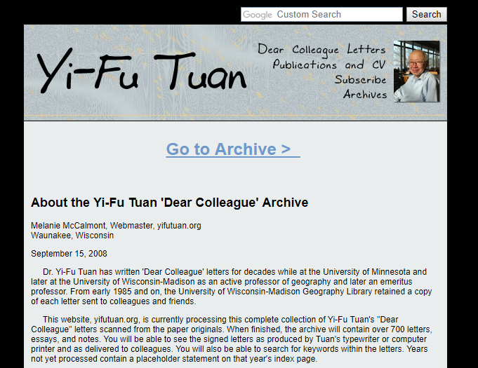
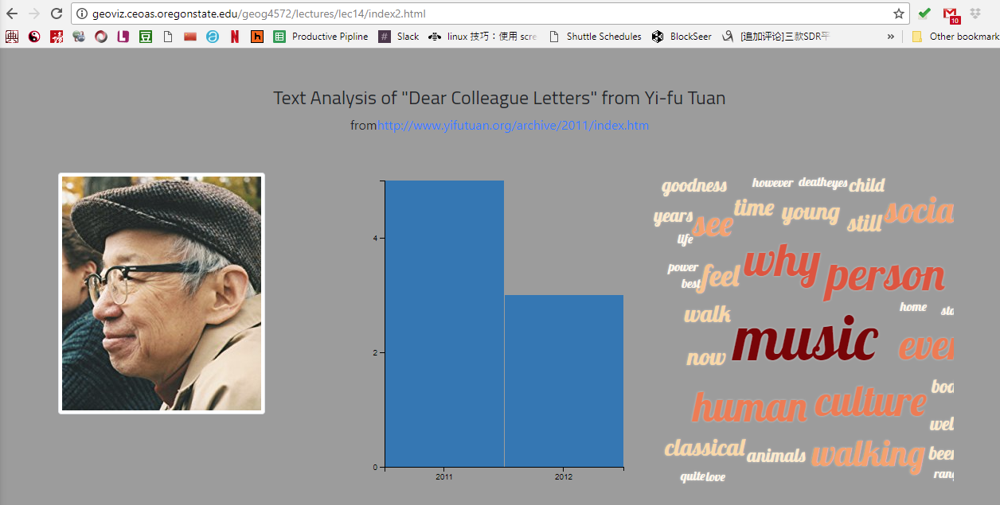

# Word Cloud

> Spring 2018 | Geography 4/572 | Geovisualization: Geovisual Analytics
>
> **Instructor:** Bo Zhao  **Location:** WITH 205 | **Time:** TR 1100 - 1150

**Learning Objectives**

- In this lecture, we will demostrate how to generate a word cloud by a jquery plugin [`jQCloud`](http://mistic100.github.io/jQCloud/demo.html).
- Able to apply word cloud analysis to a massive textual data.

A word cloud is a novelty visual representation of text data, typically used to depict keyword metadata (tags) on websites, or to visualize free form text. Tags are usually single words, and the importance of each tag is shown with font size or color. This format is useful for quickly perceiving the most prominent terms and for locating a term alphabetically to determine its relative prominence. When used as website navigation aids, the terms are hyperlinked to items associated with the tag.

In principle, the font size of a word in a word cloud is determined by its incidence. The greater the incidence, the large the size of the word, or the darker the color of the word.


> ***A word cloud*** about the term "Geography" - from [ibreakstock](https://www.videoblocks.com/video/geography-animated-word-cloud-text-design-animation-kinetic-typography-hhc0bkue-j2qxktvx).

## Data



A word cloud can be used to explore textual data.  For example, if you collected comments from hundreds of participants in a survey, a word cloud can visualize the top-frequency terms all the participants have been mentioned collectively. Also, word cloud can explore text, letter, book chapter, with the goal to quickly understand its main topics and opinions.

In this lecture, we would like to explore all the lectures which Yi-fu Tuan, a well-known geographer, have wrote and publicly shared to its colleagues. There are only 7 letters in total, each of them has ~500 words. 

Here is the visualization of the word cloud we will generate.


As you can easily observe, for all the letters from 2011 to 2012, he mentioned `music, political, why, person, human, social, culture, walking, ...` quite often. From these term, we can tell what were his major concerns; and how he interacted with the word, like the high-frequency term he used `see, feel, walk, rationalize, ...`.

First thing first, we collected these letters from http://www.yifutuan.org/archive/2011/index.htm, and then classified all the letters by their wroten year. Sebquently, we converted all the letters in an array and formatted in json. The data was named `yft.json`, and was stored in the [assets](assets/yft.json). folder

> **Note:** We change the formate to json because `jquery` supports json data reading.

Here is a code snippet of this json file

```json
 {
    "id": 1,
    "title": "How Not To Be a Minority Person",
    "content": "It is said that Winston Churchill claimed to have Red Indian blood through one of his American ancestors. If true, it is strange that he should make the claim, for it is as if being a descendent of the Duke of Marlborough was not enough and that he needed the genes of an Indian chief for added luster. If perchance Churchill had Chinese blood, ...",
    "time": "2011"
  },
 ...]
```

To read this json file, we use the method `$.getJSON(url/path, data-processing-function)` of jquery, it will be used as below.

```javascript
$.getJSON( "assets/yft.json", function( data ) {
	... ...
	... ...
});
```
the first parameter of `$.getJSON` is the path of the data, and the second one is the data processing function, the input of this function is the data read from the url.


## Initialize a HTML page

As usually, we will create an empty html page.

```html
<!DOCTYPE html>
    <head>
    </head>
    <body>
    </body>
</html>
```

Obviously, we will use `jQCloud` to make the word cloud, but in the meantime, we will also use one prerequiste library - jquery. To apply customized fonts, we will need to use `Google web fonts`, and to apply a color ramp, we will need to use `chroma.js`.

So, the head of the html will include the following libraries:

```html
<head>
    <meta charset="utf-8">
    <title>Word cloud</title>
    <link href="https://fonts.googleapis.com/css?family=Lobster|Titillium+Web" rel="stylesheet">
    <script src="https://ajax.googleapis.com/ajax/libs/jquery/3.3.1/jquery.min.js"></script>
    <script src="js/jqcloud.js"></script>
    <script src="https://cdnjs.cloudflare.com/ajax/libs/chroma-js/1.3.4/chroma.min.js"></script>

</head>
```

## Word Frequency Calculation

Having a large chuck of texts,  we will need to calculate the world frequency.

firstly, we combine all the texts as a long text string. 

```javacript
 var texts = "";
    for(var i=0;i< data.length; i++){

        texts += data[i].content + " ";
    }
```

And then,  we create the word frequency list. The first input variable is the text to process, and the second input variable is the lowest word frequency of a word which will be included in the
frequency word list. 

```javascript
frequencyList = wordFrequency(texts, 3);
```

The frequencyList is an array of objects, each of which is an dictionary of two variable, text and weight.

```javascript
[
    {
        text: "music"
        weight: 10
    },
        {
        text: "walking"
        weight: 5
    }
    ... ...
]
```

In the `wordFrequency(txt, freq)` function, it builds up an array of word and its frequency (weight). Also, we delete all those commonly used word.

```javascript
function wordFrequency(txt, freq) {

	// a regular expression to define the symbols to seperate the words
    var wordArray = txt.split(/[ .?!,*'"”“]/);
    var newArray = [], filteredArray = [], wordObj;
	// calculate the frequency of each unique terms from the text.
	wordArray.forEach(function (word) {
        wordObj = newArray.filter(function (w){
            return w.text == word.toLowerCase();
        });
        if (wordObj.length) {
            wordObj[0].weight += 1;
        } else {
            newArray.push({text: word, weight: 1});
        }
    });

    var words = ["", "that", "this", "we", "needs",...];

	//disinclude the word larger than the lowerst frequency as well as not in the commonly used terms.
	
    newArray.filter(function(word){
        if (!words.includes(word.text) && word.weight > freq) {
            filteredArray.push(word);
        }
    });

    return filteredArray;
}
```
## Data processing and visualization

As usually, to visualize the word cloud, we will need to create a html element (place holder) to hold the javacript object of  world cloud. So, in the `<body>` element, we create a `<div>` element to hold the javascript object of word cloud. 

```html
<div id="cloud"></div>
```
And then create the jQcloud object as below

```javascript
 $("#cloud").jQCloud(frequencyList, {
       colors: colorscheme,
       autoResize: true,
       // steps: 20,
       delay:5,
       shape: 'rectangular',
       fontSize: {
           from: 0.06,
           to: 0.01
       }
    });
```

j'QCloud is derived from jQuery, so we can use the `$` operator to hook to the `<div>`, whose `id` is `cloud`.

The first parameter is the url/path of the word frequency list. and second one is a dictionary of  the options for making the word cloud.

```javascript
{
    colors: colorscheme, // set the color scheme, the color will be propotional to the `weight` of a word.
    autoResize: true, // the word cloud can be resizable
    delay:5,  //delete 5miliseconds when drawing each word.
    shape: 'rectangular', // the shape of word cloud
    fontSize: {
    from: 0.06,
    to: 0.01 // set the font size, the size will be propotional to the `weight` of a word.
}
```

For more information about the options, please check [http://mistic100.github.io/jQCloud/](http://mistic100.github.io/jQCloud/).

**Style**

we define the layout in the `<style>` tag inside of the `<head>` tag. The following code will make sure the word cloud will be expaned to fullscreen, and in a light gray background color.

```html
 #cloud { width: 100%; height: 100%; margin: 0; background: #757575;}
```

Next, define the font family and style of the fonts.

```html
text-shadow: 0 0 3px rgba(255, 255, 255, 0.5);
```

This line will apply the glow effects to the text, which will make the text clearer.

In the javascript, we create an array of colors using `chroma.js`.

```javascript
colorscheme = chroma.scale('OrRd').colors(10).reverse();
```

As above, we create an array of two colors in an orange to red color ramp, and reverse the color ramp from red to orange.

Now, we have defined the color, font. they will be used in symbolize the word cloud.

As a result, we can visualize the whole piece of code as a word cloud. Check [here](http://jakobzhao.github.io/geog4572/lectures/lec14/index.html) to see how it looks like. 


We also apply a coordinated view of word cloud and a bar chart showing the number of letters  wrotten in each year. Check [here](http://jakobzhao.github.io/geog4572/lectures/lec14/index2.html) to see how it looks like. Please try to read this cloud, and how it was made to be coordinated.



In this lecture, we introduced a word cloud using the text analysis of Yi-Fu's letters as an example, I encourage you to make a word cloud with your own data, and reflect on how this visual analysis can help you to explore your data set. 

## References

[1] https://wiki.q-researchsoftware.com/wiki/Word_Cloud