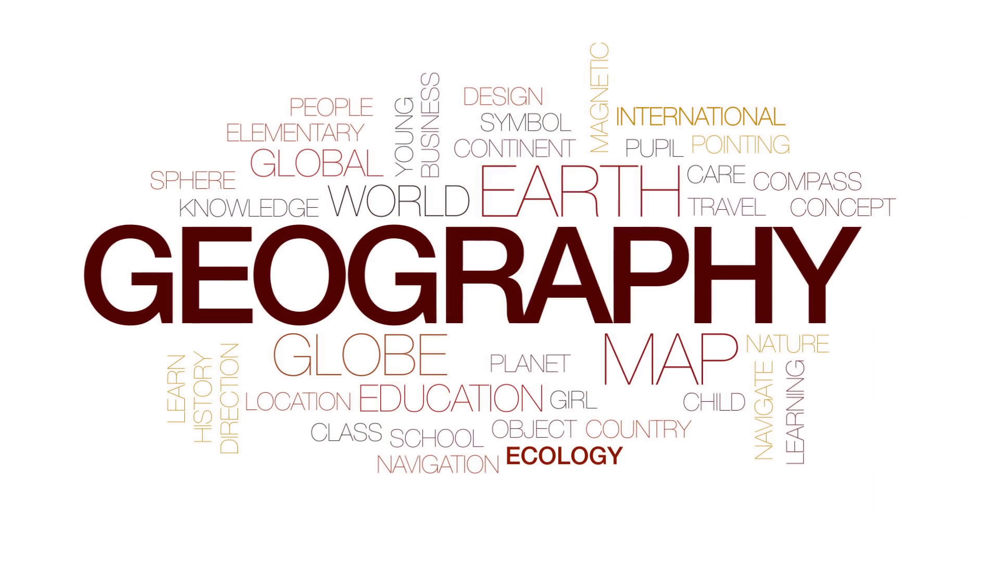

# Word Cloud

> Spring 2018 | Geography 4/572 | Geovisualization: Geovisual Analytics
>
> **Instructor:** Bo Zhao  **Location:** WITH 205 | **Time:** TR 1100 - 1150

**Learning Objectives**

- In this lecture, we will demostrate how to generate a word cloud by a jquery plugin [`jQCloud`](http://mistic100.github.io/jQCloud/demo.html).

A word cloud is a novelty visual representation of text data, typically used to depict keyword metadata (tags) on websites, or to visualize free form text. Tags are usually single words, and the importance of each tag is shown with font size or color. This format is useful for quickly perceiving the most prominent terms and for locating a term alphabetically to determine its relative prominence. When used as website navigation aids, the terms are hyperlinked to items associated with the tag.

In principle, the font size of a word in a word cloud is determined by its incidence. The greater the incidence, the large the size of the word, or the darker the color of the word.

> *A word cloud * on the term "Geography" - from [ibreakstock](https://www.videoblocks.com/video/geography-animated-word-cloud-text-design-animation-kinetic-typography-hhc0bkue-j2qxktvx).

## References

[1] https://wiki.q-researchsoftware.com/wiki/Word_Cloud